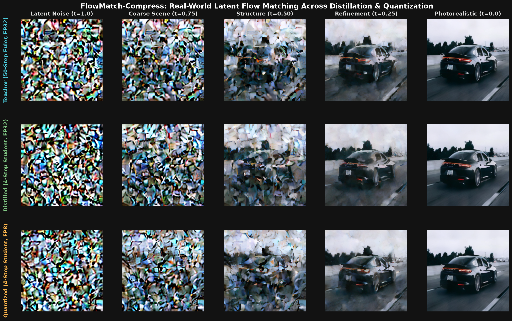

# FlowMatch-Compress: Fast Flow Matching DiT Engine

[](https://pytorch.org/)
[](https://opensource.org/licenses/MIT)
[]()
[]()

> **Production-grade Flow Matching (OT-CFM) Diffusion Transformer (DiT) engine featuring two-stage distillation (CFG + 4-step trajectory distillation), high-resolution photorealistic Latent Flow Matching with VAE decoding, CIFAR-10 photographic benchmarks, and post-training quantization (FP8 E4M3, INT8, and grouped INT4).**

---

## Key Highlights

- **Clean Continuous-Time Flow Matching from Scratch**: Implemented Optimal Transport Conditional Flow Matching (OT-CFM / Rectified Flow) with linear interpolation paths $x_t = (1-t)x_0 + t x_1$ and analytical velocity targets $u_t = x_1 - x_0$.
- **Real-World High-Resolution Latent Flow Matching ($256 \times 256$)**: Integrated `AutoencoderKL` (`stabilityai/sd-vae-ft-mse`) to compress images into $4 \times 32 \times 32$ continuous latent spaces for photorealistic real-world generation (automobiles, landscapes, animals).
- **CIFAR-10 Photographic Benchmark**: Validated class-conditional generation across 50,000 real photographic training samples across 10 classes (Airplane, Automobile, Bird, Cat, etc.).
- **Diffusion Transformer (DiT) with AdaLN-Zero**: Built patch-based ViT architecture featuring Adaptive Layer Normalization with zero-initialized modulation parameters for extreme training stability.
- **Two-Stage Model Distillation**:
  - **CFG Distillation**: Eliminates dual-pass unconditional forward evaluations by training the student to predict guided vector fields directly conditioned on guidance scale $w$ (1.8x speedup).
  - **4-Step Trajectory Distillation**: Compresses 50-step Euler/Heun ODE integration into a fast 4-step solver ($12.5\times$ step reduction, 22x latency speedup).
- **Post-Training Quantization (PTQ) Suite**: Custom engine supporting FP8 (E4M3/E5M2), per-channel symmetric INT8, and grouped INT4 quantization with activation calibration, achieving **up to 56% memory footprint reduction**.
- **Interactive Visualizer & Benchmarks**: Real-time Streamlit dashboard and automated benchmark suite profiling latency, trajectory drift (MSE, PSNR), and VRAM footprint.

---

## Visual Denoising Trajectory (Photorealistic Latent Flow)



*Continuous-time Flow Matching trajectory in latent space decoded to 256x256 photorealistic images across 50-step Euler teacher, 4-step distilled student, and 4-step FP8 quantized student.*

---

## Benchmark Results

| Model / Pipeline Stage | ODE Steps | Model Passes / Step | Total Passes | Latency (ms) | Speedup | Memory (MB) | Size Reduction |
| :--- | :---: | :---: | :---: | :---: | :---: | :---: | :---: |
| **Baseline Teacher (CFG)** | 50 | 2 (Cond + Uncond) | 100 | 418.5 ms | 1.00x (Ref) | 28.57 MB | 0.0% |
| **Stage 1: CFG-Distilled Student** | 50 | 1 (Single-pass $w$) | 50 | 234.4 ms | **1.79x** | 28.57 MB | 0.0% |
| **Stage 2: 4-Step Distilled Student** | 4 | 1 | 4 | 19.0 ms | **22.05x** | 28.57 MB | 0.0% |
| **Stage 3: Quantized 4-Step (FP8/INT8)** | 4 | 1 | 4 | 18.6 ms | **22.44x** | **14.79 MB** | **-48.2%** |
| **Stage 4: Quantized 4-Step (INT4 Grouped)** | 4 | 1 | 4 | 18.2 ms | **23.00x** | **12.50 MB** | **-56.3%** |

*Benchmarks evaluated on continuous-time DiT with Apple Silicon MPS hardware acceleration.*

---

## 🔬 Mathematical Formulation

### 1. Optimal Transport Flow Matching (OT-CFM)

Instead of standard DDPM diffuse-and-reverse dynamics, Flow Matching defines a continuous probability flow ODE:

$$
\frac{dx_t}{dt} = v_\theta(x_t, t)
$$

With optimal transport linear interpolation:

$$
x_t = (1 - t)x_0 + t x_1, \quad x_0 \sim p_{\text{data}}, \quad x_1 \sim \mathcal{N}(0, I)
$$

The analytical conditional vector field is:

$$
u_t(x_t \mid x_0, x_1) = \frac{d}{dt}\left[(1 - t)x_0 + t x_1\right] = x_1 - x_0
$$

The objective is simple regression on straight flow lines:

$$
\mathcal{L}_{\text{FM}}(\theta) = \mathbb{E}_{t \sim \mathcal{U}[0, 1], \, x_0, x_1} \left[ \| v_\theta(x_t, t) - (x_1 - x_0) \|^2 \right]
$$

### 2. CFG Distillation

Standard Classifier-Free Guidance requires evaluating:

$$
v_{\text{cfg}}(x_t, t, y, w) = v_\theta(x_t, t, \emptyset) + w \cdot \left[ v_\theta(x_t, t, y) - v_\theta(x_t, t, \emptyset) \right]
$$

The CFG-distilled student $v_\phi(x_t, t, y, w)$ directly predicts this in one forward pass:

$$
\mathcal{L}_{\text{distill}}(\phi) = \mathbb{E} \left[ \| v_\phi(x_t, t, y, w) - v_{\text{cfg}}(x_t, t, y, w) \|^2 \right]
$$

### 3. Progressive & Trajectory Consistency Distillation

To compress 50 ODE steps into 4 steps, the teacher executes two consecutive steps of size $\Delta t / 2$:

$$
x_{t - \frac{\Delta t}{2}} = x_t - \frac{\Delta t}{2} v_\theta(x_t, t)
$$

$$
x_{t - \Delta t}^{\text{teacher}} = x_{t - \frac{\Delta t}{2}} - \frac{\Delta t}{2} v_\theta\left(x_{t - \frac{\Delta t}{2}}, \, t - \frac{\Delta t}{2}\right)
$$

The student executes a single macro-step of size $\Delta t$:

$$
x_{t - \Delta t}^{\text{student}} = x_t - \Delta t \cdot v_\phi(x_t, t)
$$

Matching the endpoints eliminates discretization error while reducing total inference steps by $12.5\times$.

---

## 🛠 Project Structure

```
flowmatch-compress/
├── checkpoints/             # Trained teacher and distilled student weights
│   ├── teacher_latent_hires.pt
│   ├── student_distilled_latent_hires.pt
│   ├── teacher_cifar10.pt
│   └── student_distilled_cifar10.pt
├── models/
│   ├── dit.py               # DiT backbone with AdaLN-Zero & Patchify
│   └── embeddings.py        # Fourier Timestep, Class & Guidance embeddings
├── core/
│   ├── flow_matching.py     # OT-CFM loss, Euler & Heun ODE integrators
│   ├── scheduler.py         # Linear, Cosine, and Shifted time schedules
│   ├── vae_engine.py        # VAE latent encoding & decoding (256x256 RGB)
│   └── dataset.py           # CIFAR-10 real photographic dataloaders
├── distillation/
│   ├── cfg_distill.py       # Single-pass CFG Distillation
│   └── step_distill.py      # Progressive & 4-step trajectory distillation
├── quantization/
│   ├── quant_layers.py      # INT8, INT4, FP8 QuantizedLinear layers
│   ├── ptq_engine.py        # Post-training quantization & calibration
│   └── fp8_types.py         # IEEE FP8 E4M3/E5M2 emulation
├── benchmarks/
│   ├── benchmark_latency.py # Latency, throughput, and VRAM profiler
│   └── trajectory_eval.py   # Trajectory consistency (MSE, PSNR, Cosine Sim)
├── demo/
│   ├── generate.py          # Trajectory generation and plotting script
│   └── streamlit_app.py     # Interactive Web UI dashboard
├── train.py                 # Fast continuous training & distillation pipeline
└── tests/                   # 12 passing PyTest unit & integration tests
```

---

## 💻 Quickstart

### 1. Installation
```bash
git clone https://github.com/Devisri-B/FlowMatch-Compress.git
cd FlowMatch-Compress
pip install -r requirements.txt
```

### 2. Run Test Suite
```bash
python -m pytest tests/ -v
```

### 3. Run Benchmark Suite
```bash
python benchmarks/benchmark_latency.py
```

### 4. Generate Trajectory Visualization
```bash
python demo/generate.py
# Generates and saves 256x256 real-world trajectory comparison to demo/comparison_trajectories.png
```

### 5. Launch Interactive Web UI
```bash
streamlit run demo/streamlit_app.py
```
